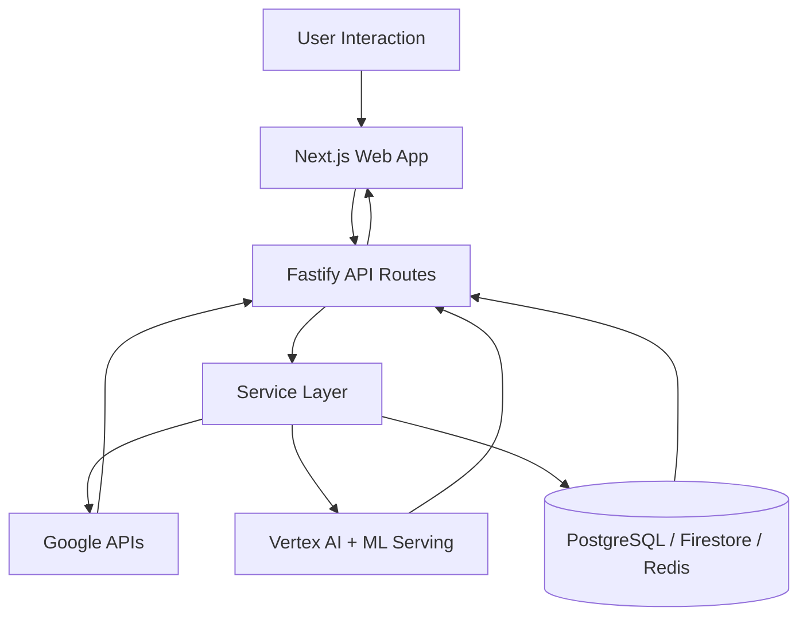

# Architecture

ODYSSEY AI uses a five-layer architecture that separates interaction, orchestration, integration, intelligence, and persistence. This keeps route handlers thin, service logic testable, and external integrations isolated from UI code.

## Layer 1: Frontend Experience

The Next.js app renders trip planning, profile, pulse, and collaborative views. Zustand manages local UX state, while React Query handles server-state fetching and cache invalidation.

## Layer 2: API and Contracts

Fastify routes parse/validate requests and delegate to services. All successful route responses use a unified `ApiResponse<T>` envelope.

## Layer 3: Service Orchestration

Services coordinate AI prompts, route scoring, disruption generation, and pricing logic. Services do not contain HTTP concerns and can be unit-tested in isolation.

## Layer 4: External Intelligence and Platform APIs

Google Maps APIs provide place and route context, Gemini provides language reasoning, and Vertex serves model endpoints. Firebase supports identity and collaboration primitives.

## Layer 5: Persistence and Caching

PostgreSQL stores structured trip and profile data, Firestore/Firebase stores collaborative and denormalized views, and Redis caches high-read API responses.

## Technology Selection Rationale

- Next.js + TypeScript for fast iteration with strong type safety.
- Fastify for high-throughput API performance and plugin-based middleware.
- Zod for schema validation and strict boundary control.
- Vertex AI for managed model serving and deployment consistency.
- Firebase for auth + realtime collaboration ergonomics.
